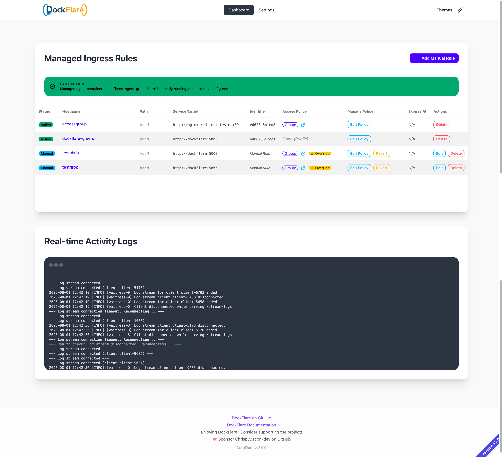

# DockFlare: Cloudflare Tunnel Ingress Controller

[](https://github.com/ChrispyBacon-dev/baconflip)
[]()
[](https://en.wikipedia.org/wiki/Central_processing_unit)
[](https://shields.io/)
[](https://hub.docker.com/r/alplat/dockflare)
[](https://www.python.org/)
[](https://github.com/ChrispyBacon-dev/dockflare/issues)
[](https://github.com/ChrispyBacon-dev/dockflare/commits/stable)
[](https://github.com/ChrispyBacon-dev/dockflare/commits/stable)

DockFlare automates Cloudflare Tunnel ingress rule management based on Docker container labels, simplifying public exposure of your Dockerized applications. It eliminates manual Cloudflare configuration, acting as a self-hosted ingress controller.

## Key Features

- **Automated Cloudflare Tunnel Management**: Creates/uses a specified tunnel, retrieves Tunnel ID & Token.
- **`cloudflared` Agent Lifecycle**: Deploys & manages the `cloudflared` container (using Tunnel Token).
- **Dynamic Ingress via Docker Labels**:
  - Monitors Docker events for containers with labels (prefix: `cloudflare.tunnel.`): `enable="true"`, `hostname="subdomain.example.com"`, `service="http://target:port"`.
  - Automatically updates Cloudflare Tunnel configuration to match running, labeled containers.
- **Graceful Deletion**: Configurable grace period before removing ingress rules when a container stops.
- **State Persistence**: Saves `managed_rules` to `state.json` for restarts.
- **Reconciliation**: On startup, ensures consistency between Docker containers, saved state, and Cloudflare configuration.
- **Web UI**: Status dashboard with:
  - Tunnel & agent status.
  - Start/Stop agent controls.
  - Managed ingress rule list with status, container ID, deletion time, and "Force Delete" option.
- **Real-time Log Streaming**: View logs in real-time using Server-Sent Events (SSE).
- **Content Security Policy (CSP)**: Ensures secure loading of resources and compatibility with reverse proxies.



## How It Works

DockFlare listens for Docker container events and manages Cloudflare Tunnel ingress rules dynamically. By labeling your containers, DockFlare automatically configures the tunnel and DNS records, ensuring your services are publicly accessible.

### Example Workflow

1. **Start DockFlare**: Run the DockFlare container with the required environment variables.
2. **Label Your Containers**: Add labels to your Docker containers to define their public hostname and service target.
3. **Automatic Configuration**: DockFlare detects the labeled containers and updates the Cloudflare Tunnel configuration and DNS records.
4. **Graceful Deletion**: When a container stops, DockFlare schedules its ingress rule for deletion after a configurable grace period.

## Getting Started

There are two main ways to get DockFlare running:

1.  **Quick Start:** Directly use Docker Compose with the provided configuration.
2.  **From Repository:** Clone the repository first, then configure and run.

Choose the method that best suits your needs.

### Prerequisites

- Docker: [Install Docker](https://docs.docker.com/engine/install/)
- Docker Compose: [Install Docker Compose](https://docs.docker.com/compose/install/)
- Cloudflare Account with:
  - API Token with Zone:DNS:Edit and Account:Cloudflare Tunnel:Edit permissions
  - Account ID (found in Cloudflare Dashboard → Overview)
  - Zone ID (found in Cloudflare Dashboard → Overview)

### Option 1: Quick Start (Using Docker Compose)

This method allows you to run DockFlare quickly without cloning the entire repository.

1. **Create `docker-compose.yml`:**
   Create a file named `docker-compose.yml` in a directory of your choice and paste the following content:

   ```yaml
   version: '3.8'
   services:
     dockflare:
       image: alplat/dockflare:stable
       container_name: dockflare
       restart: unless-stopped
       ports:
         - "5000:5000"  # Web UI port
       env_file:
         - .env  # Load environment variables from .env file
       volumes:
         - /var/run/docker.sock:/var/run/docker.sock:ro  # Required to monitor Docker events
         - dockflare_data:/app/data  # Persistent storage for state
       networks:
         - cloudflare-net  # Network for communication with cloudflared agent
       environment:
         - STATE_FILE_PATH=/app/data/state.json # Path to state file inside the container
         - TZ=Europe/Zurich # Optional: Set your timezone, e.g., America/New_York
   volumes:
     dockflare_data:
   networks:
     cloudflare-net:
       name: cloudflare-net # Creates/uses a dedicated network for the tunnel
   ```

2. **Create and Configure `.env`:**
   Create a file named `.env` in the *same directory* as your `docker-compose.yml`. Add your Cloudflare details:

   ```dotenv
   # --- Required Cloudflare Configuration ---
   CF_API_TOKEN=<YOUR_CLOUDFLARE_API_TOKEN>
   CF_ACCOUNT_ID=<YOUR_CLOUDFLARE_ACCOUNT_ID>
   CF_ZONE_ID=<YOUR_CLOUDFLARE_ZONE_ID> # Primary domain for DNS records
   TUNNEL_NAME=<DESIRED_TUNNEL_NAME>    # e.g., my-dockflare-tunnel

   # --- Optional Configuration ---
   GRACE_PERIOD_SECONDS=28800 # Default: 8 hours (8 * 60 * 60). Time before deleting rules for stopped containers.
   # LOG_LEVEL=INFO           # Optional: Set log level (DEBUG, INFO, WARNING, ERROR). Default: INFO
   
   # --- Optional: External cloudflared mode ---
   # USE_EXTERNAL_CLOUDFLARED=true
   # EXTERNAL_TUNNEL_ID=your_external_tunnel_id
   ```

   > **Note:** Environment variables can be set in either the `docker-compose.yml` file or the `.env` file. The `.env` file is typically used for sensitive information and configuration that might change.

3. **Run DockFlare**:

   ```bash
   docker compose up -d
   ```

### Option 2: From Cloned Repository

This method involves cloning the repository, which gives you access to the example files directly.

1. **Clone the repository:**
   ```bash
   git clone https://github.com/ChrispyBacon-dev/DockFlare.git
   cd DockFlare
   ```

2. **Configure the `.env` file:**
   Copy the example configuration file and then edit it with your details:

   ```bash
   cp .env.example .env
   nano .env # or use your preferred text editor
   ```

   Fill in the necessary variables as described in Option 1, Step 2.

3. **Run with Docker Compose:**
   Ensure you are in the `DockFlare` directory (where the `docker-compose.yml` file is located) and run:

   ```bash
   docker compose up -d
   ```

### Architecture Support

- **Currently Supported:** The pre-built Docker image (`alplat/dockflare:stable`) is currently only available for `x86_64` / `amd64` architectures.

### Next Steps

1. **Access the Web UI**: Open `http://localhost:5000` in your browser.

2. **Label Your Containers**:
   To expose a service through DockFlare, add the following labels to your container:

   ```yaml
   services:
     my-service:
       image: nginx:latest
       labels:
         # Enable DockFlare management for this container
         cloudflare.tunnel.enable: "true"
         
         # The public hostname to expose (must be a valid domain you control)
         cloudflare.tunnel.hostname: "my-service.example.com"
         
         # The internal service address (protocol://host:port)
         cloudflare.tunnel.service: "http://my-service:80"
         
         # Optional: Specify a different zone for this hostname
         # cloudflare.tunnel.zonename: "example.com"
         
         # Optional: Disable TLS verification for this service
         # cloudflare.tunnel.no_tls_verify: "true"
       networks:
         - cloudflare-net  # Must be in a network that DockFlare can reach
   ```

3. **Restart or Deploy Labeled Containers:**
   After adding the labels, (re)start the labeled containers (e.g., `docker-compose up -d my-web-app`). DockFlare will detect the labels and automatically configure the Cloudflare Tunnel ingress rules.

## Configuring Cloudflare Credentials (`.env` file)

DockFlare needs credentials to interact with your Cloudflare account to manage tunnels and DNS records. You'll need to provide these in the `.env` file.

**1. Finding Your Account ID (`CF_ACCOUNT_ID`)**

Your Account ID identifies your entire Cloudflare account.

- Log in to the [Cloudflare Dashboard](https://dash.cloudflare.com/).
- Select any of your domain names (zones).
- On the domain's **Overview** page, scroll down the right-hand sidebar.
- You'll find your **Account ID** listed there. Copy this value.
  - *Direct Link (after login):* You can often find it quickly here: `https://dash.cloudflare.com/?to=/:account/support` (Look under "Account Details").

**2. Finding Your Zone ID (`CF_ZONE_ID`)**

Your Zone ID identifies a specific domain (zone) managed within your Cloudflare account.

- **Primary Zone:** You must specify *one* Zone ID here. This acts as the **primary** or **default** zone where DockFlare will create DNS CNAME records for your services *unless* you explicitly specify a different zone using labels on a container.
- **Multi-Zone Support:** DockFlare *can* manage DNS records across multiple zones within the same Cloudflare account (identified by `CF_ACCOUNT_ID`). To use a zone *other* than this primary one for a specific service, you will use the `cloudflare.tunnel.zonename` label on that service's container.
- **API Token Requirement:** Ensure the API Token you create has `Zone:DNS:Edit` permissions covering *all* the zones you intend to use, including this primary zone and any others you might specify with labels. Granting access to "All zones from an account" during token creation is the simplest way to enable this flexibility.

- **How to Find the Primary Zone ID:**
  1. Log in to the [Cloudflare Dashboard](https://dash.cloudflare.com/).
  2. Click on the **specific domain name** (e.g., `example.com`) that you want to designate as your **primary** zone for DockFlare.
  3. On that domain's **Overview** page, scroll down the right-hand sidebar.
  4. You'll find the **Zone ID** listed just below the Account ID. Copy this value to use for `CF_ZONE_ID` in your `.env` file.

**3. Creating the API Token (`CF_API_TOKEN`)**

For security, DockFlare requires an API **Token** with specific, limited permissions, rather than your Global API Key.

- **Permissions Needed:**
  - `Account` > `Cloudflare Tunnel` > `Edit`: Allows DockFlare to create, list, and delete Cloudflare Tunnels within your account.
  - `Zone` > `DNS` > `Edit`: Allows DockFlare to create and delete DNS records (specifically CNAME records pointing to your tunnel) within your zones.

- **Steps to Create the Token:**
  1. Log in to the [Cloudflare Dashboard](https://dash.cloudflare.com/).
  2. Click your **profile icon** in the top right corner and select "**My Profile**".
  3. Navigate to the "**API Tokens**" tab on the left sidebar.
  4. Click the "**Create Token**" button.
  5. Scroll down to the "**Custom token**" section and click "**Get started**".
  6. **Token Name:** Give your token a descriptive name, e.g., `DockFlare-Manager`.
  7. **Permissions:** Configure the following permissions:
     - **Permission 1 (Tunnel Management):**
       - Select: `Account`
       - Select: `Cloudflare Tunnel`
       - Select: `Edit`
     - **Permission 2 (DNS Management):**
       - Click "**+ Add more**"
       - Select: `Zone`
       - Select: `DNS`
       - Select: `Edit`
  8. **Account Resources:**
     - For the `Account - Cloudflare Tunnel - Edit` permission row, ensure it's set to:
       - `Include` > `Specific account` > `[Your Account Name]` (Select your main account).
  9. **Zone Resources:**
     - For the `Zone - DNS - Edit` permission row, configure it to grant access to the zones DockFlare might need:
       - `Include` > `All zones from an account` > `[Your Account Name]`
       - *(This is the most flexible option, allowing DockFlare to manage DNS for the primary `CF_ZONE_ID` and any other zones you might specify using the `cloudflare.tunnel.zonename` label later.)*
       - *(Alternatively, if you *only* ever plan to use the single zone defined by `CF_ZONE_ID`, you could select `Include` > `Specific zone` > `[Your Primary Domain Zone]`. However, using "All zones from an account" is generally recommended for flexibility.)*
  10. **Client IP Address Filtering (Optional but Recommended):** If you know the static IP address(es) from which DockFlare will be running, you can restrict the token to only work from those IPs for added security.
  11. **TTL (Optional):** Set an expiration date for the token if desired.
  12. Click "**Continue to summary**".
  13. Review the permissions and resource scopes carefully. Ensure they match the requirements (`Account:Cloudflare Tunnel:Edit`, `Zone:DNS:Edit`).
  14. Click "**Create Token**".
  15. **Important:** Cloudflare will now display your API Token. **Copy this token immediately** and store it securely. You will **not** be able to see it again after leaving this page.

## External Cloudflared Mode

DockFlare can work with an existing `cloudflared` container. This is useful if you're already using cloudflared for other services or prefer to manage it separately. To enable this mode:

1. Set `USE_EXTERNAL_CLOUDFLARED=true` in your `.env` file.
2. Provide the external tunnel ID using `EXTERNAL_TUNNEL_ID`.

In this mode, DockFlare will only manage DNS records and ingress rules, but not the cloudflared agent itself.

```dotenv
USE_EXTERNAL_CLOUDFLARED=true
EXTERNAL_TUNNEL_ID=your-tunnel-id-from-cloudflare
```

### Finding Your Tunnel ID

When using the external cloudflared mode, you'll need to provide the Tunnel ID. Here's how to find it:

1. Log in to your [Cloudflare Dashboard](https://dash.cloudflare.com)
2. Navigate to **Access** → **Tunnels** in the left sidebar
3. Find your tunnel in the list and click on it
4. The Tunnel ID is displayed in two places:
   - In the URL of the page: `https://dash.cloudflare.com/[account-id]/access/tunnels/view/[tunnel-id]`
   - In the **Overview** tab under "Tunnel ID"
5. Copy this ID and set it as your `EXTERNAL_TUNNEL_ID` in the `.env` file

Example Tunnel ID format: `6ff42ae2-765d-4adf-befc-ca51f8e4e688`

### Switching Between Internal and External Cloudflared Modes

If you want to switch from using DockFlare's built-in cloudflared container to an external cloudflared instance, you'll need to perform several cleanup steps to ensure a smooth transition:

1. **Stop the DockFlare container** first:
   ```bash
   docker stop dockflare
   ```

2. **Remove the existing cloudflared agent container** managed by DockFlare:
   ```bash
   docker rm -f cloudflared-agent-your_tunnel_name
   ```

3. **Clean up DNS records in Cloudflare dashboard**:
   - Navigate to Cloudflare Dashboard → DNS
   - Find and delete the CNAME records created for your services
   - These typically have names matching your container hostnames and point to `{tunnel-id}.cfargotunnel.com`

4. **Delete the tunnel in Cloudflare dashboard** (if you're creating a new external tunnel):
   - Navigate to Cloudflare Dashboard → Access → Tunnels
   - Find the tunnel created by DockFlare
   - Click the three dots menu → Delete

5. **Reset the state file** to ensure clean configuration:
   ```bash
   # If using Docker volumes
   docker volume rm dockflare_data
   # Or if mounted as a file
   rm /path/to/your/state.json
   ```

6. **Set up your external cloudflared instance** following Cloudflare's documentation:
   - Create a new tunnel or use an existing one
   - Make sure to note the Tunnel ID
   - Configure and run the cloudflared daemon

7. **Update your .env file** with the external configuration:
   ```dotenv
   USE_EXTERNAL_CLOUDFLARED=true
   EXTERNAL_TUNNEL_ID=your_external_tunnel_id
   ```

8. **Restart DockFlare** with the new configuration:
   ```bash
   docker start dockflare
   # Or if you removed the volume, you may need to recreate the container
   docker-compose up -d
   ```

9. **Verify container discovery** after restart:
   - Check the Web UI to ensure your containers are detected
   - Verify that DNS records are created for your services
   - Test that your services are accessible through the tunnel

After the switch, DockFlare will:
- Discover containers with the appropriate labels
- Create new DNS records pointing to your external tunnel
- Update the ingress configuration for your external tunnel
- Start with a fresh state based on your running containers

> **Note**: During this transition, your services may experience brief downtime as DNS records are deleted and recreated. The DNS propagation might take some time depending on TTL settings.

> **Important**: When switching to external mode, the tunnel name in your .env file is no longer used, but you still need to specify the correct `EXTERNAL_TUNNEL_ID`.

## Advanced Configuration

### Environment Variables

| Variable | Description | Default |
|----------|-------------|---------|
| `CF_API_TOKEN` | Cloudflare API token | (Required) |
| `CF_ACCOUNT_ID` | Cloudflare account ID | (Required) |
| `CF_ZONE_ID` | Default Cloudflare zone ID | (Required unless using `zonename` label) |
| `TUNNEL_NAME` | Name for the Cloudflare tunnel | (Required unless using external tunnel) |
| `GRACE_PERIOD_SECONDS` | Time before removing rules after container stops | 28800 (8 hours) |
| `CLEANUP_INTERVAL_SECONDS` | Interval for checking expired rules | 300 (5 minutes) |
| `LABEL_PREFIX` | Prefix for Docker labels | cloudflare.tunnel |
| `USE_EXTERNAL_CLOUDFLARED` | Use an existing cloudflared agent | false |
| `EXTERNAL_TUNNEL_ID` | Tunnel ID for external cloudflared mode | (Required if `USE_EXTERNAL_CLOUDFLARED=true`) |
| `SCAN_ALL_NETWORKS` | Scan containers across all Docker networks | false |
| `CLOUDFLARED_NETWORK_NAME` | Docker network for cloudflared agent | cloudflare-net |
| `STATE_FILE_PATH` | Path for state persistence | /app/data/state.json |
| `LOG_LEVEL` | Set the application's logging verbosity | INFO |
| `TZ` | Set your timezone | UTC |

### Container Labels

| Label | Description | Required | Example |
|-------|-------------|----------|---------|
| `{prefix}.enable` | Enable DockFlare for this container | Yes | `"true"` |
| `{prefix}.hostname` | Public hostname to expose | Yes | `"app.example.com"` |
| `{prefix}.service` | Internal service address | Yes | `"http://app:80"` |
| `{prefix}.zonename` | Zone name for this hostname | No | `"example.com"` |
| `{prefix}.no_tls_verify` | Disable TLS verification | No | `"true"` |

### Real-time Log Streaming

DockFlare provides real-time logs using Server-Sent Events (SSE). Open the "Real-time Activity Logs" section in the Web UI to view logs as they happen. This feature is especially useful for monitoring container events and configuration changes.

### DNS Zone Management

By default, DockFlare uses the `CF_ZONE_ID` specified in your environment variables for all DNS records. However, you can specify different zones for individual containers using the `cloudflare.tunnel.zonename` label. This allows you to expose services across multiple domains.

```yaml
services:
  my-service:
    # ...other configuration...
    labels:
      cloudflare.tunnel.enable: "true"
      cloudflare.tunnel.hostname: "app.customdomain.com"
      cloudflare.tunnel.service: "http://my-service:80"
      cloudflare.tunnel.zonename: "customdomain.com"
```

## Technical Implementation

- **Language:** Python 3
- **Core Libraries:**
  - `requests`: Cloudflare API interaction.
  - `docker`: Docker API interaction and event handling.
  - `Flask`: Web UI.
  - `python-dotenv`: Configuration management.
  - `threading`: Background tasks.
- **Deployment:** Runs as a Docker container, typically managed by `docker-compose.yml`. Requires mounting the Docker socket (`/var/run/docker.sock`) to interact with the Docker daemon.
- **Configuration:**
  - Primarily via an `.env` file (API Token, Account ID, Tunnel Name, optional grace period, labels, etc.).
  - Docker labels on target application containers.
  - Environment variables can be set in either the `docker-compose.yml` file or the `.env` file.
- **Authentication:** Uses a Cloudflare API Token with Account:Cloudflare Tunnel:Edit permissions and Zone:DNS:Edit for DNS record management.

## Key Files

- `app.py`: Main Python application code (Flask routes, API logic, Docker event handling, state management).
- `Dockerfile`: Builds the application container, installing Python, dependencies, and `cloudflared`.
- `docker-compose.yml`: Defines the service for running the application container and mounts the Docker socket.
- `requirements.txt`: Lists Python dependencies.
- `.env`: Stores sensitive configuration and parameters (API keys, IDs, tunnel name). **Do not commit this file!**
- `state.json`: (Created at runtime) Persists the managed rules state.

## Troubleshooting

### Common Issues

- **Log Stream Not Working**: Ensure your browser supports Server-Sent Events (SSE). Try a different browser or check for network filtering.
- **Reverse Proxy Issues**: If you're using a reverse proxy in front of DockFlare's Web UI, make sure it's configured to properly handle SSE connections and WebSocket connections.
- **Container Not Being Detected**: Verify that:
  - Your container has the right labels
  - The container is in a network DockFlare can access (use `SCAN_ALL_NETWORKS=true` if needed)
  - The hostname format is valid (must be a proper domain name)
  - The service format is valid (must include protocol and host:port)

### Debugging

- Check the logs in the Web UI or the container logs using:

  ```bash
  docker logs dockflare
  ```

- Verify Cloudflare API token permissions: Requires Zone:DNS:Edit and Account:Cloudflare Tunnel:Edit

- If a container stops responding to changes, try forcing deletion of the rule via the Web UI and then restart the container.

### Health Checks

- **DockFlare Health**: Access `http://localhost:5000/ping` for basic health information
- **Cloudflare Connectivity**: Access `http://localhost:5000/cloudflare-ping` through your tunnel to verify Cloudflare connection details

## Contributing

Contributions are welcome! Please open an issue or submit a pull request on GitHub.

1. Fork the repository
2. Create a feature branch (`git checkout -b feature/amazing-feature`)
3. Commit your changes (`git commit -m 'Add some amazing feature'`)
4. Push to the branch (`git push origin feature/amazing-feature`)
5. Open a Pull Request

## License

DockFlare is licensed under the MIT License. See `LICENSE.MD` for details.