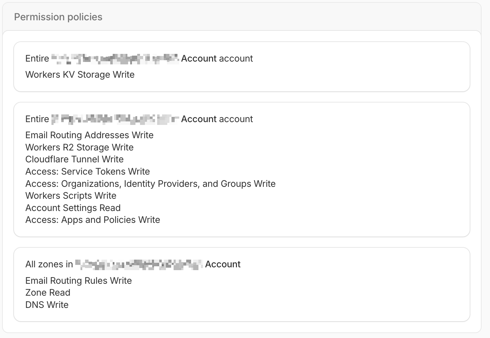

# Voraussetzige

Bevor du afahsch, lueg dass du Folgendes hesch:

*   **Docker & Docker Compose:** DockFlare isch e Docker-basierti Aawändig, drum mues Docker u Docker Compose uf dim System installiert sii.
*   **Es Cloudflare-Konto:** Du bruuchsch es Cloudflare-Konto, zum dini Domains z'verwalte u API-Tokens z'erstelle.
*   **Dini Cloudflare-Konto-ID:** Du findscht dini Konto-ID im Cloudflare-Dashboard.
*   **Die Zonen-ID für die Domain, die du bruuche wotsch:** Jede Domain in Cloudflare hat eine eindeutige Zonen-ID.
*   **Es Cloudflare API-Token:** Du muesch es Cloudflare API-Token mit de folgende Berechtige erstelle:
    *   `Account:Cloudflare Tunnel:Edit`
    *   `Account:Account Settings:Read`
    *   `Account:Access: Apps and Policies:Edit`
    *   `Account:Access: Organizations, Identity Providers, and Groups:Edit`
    *   `Zone:Zone:Read`
    *   `Zone:DNS:Edit`

