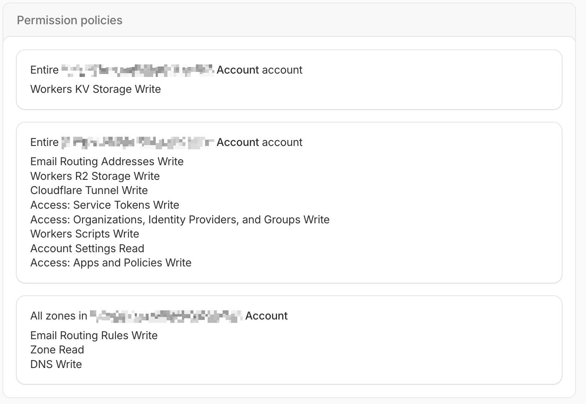

# Predpoklady

Skôr než začneš, uisti sa, že máš nasledovné:

* **Docker a Docker Compose:** DockFlare je aplikácia postavená na Dockeri, takže budeš potrebovať nainštalovaný Docker aj Docker Compose.
* **Cloudflare účet:** Na správu domén a vytváranie API tokenov budeš potrebovať Cloudflare účet.
* **Tvoje Cloudflare Account ID:** Account ID nájdeš v Cloudflare dashboarde.
* **Zone ID:** Každá doména v Cloudflare má jedinečné Zone ID, ktoré budeš potrebovať.
* **Cloudflare API token:** Vytvor si Cloudflare API token s týmito povinnými oprávneniami:
    * `Account:Cloudflare Tunnel:Write`
    * `Account:Account Settings:Read`
    * `Account:Access: Apps and Policies:Write`
    * `Account:Access: Organizations, Identity Providers, and Groups:Write`
    * `Account:Access: Service Tokens:Write`
    * `Zone:Zone:Read`
    * `Zone:DNS:Write`

    **Pre voliteľné e-mailové funkcie DockFlare pridaj tieto ďalšie oprávnenia:**
    * `Workers Scripts:Write`
    * `Workers KV Storage:Write`
    * `Workers R2 Storage:Write`
    * `Email Routing Addresses:Write`
    * `Email Routing Rules:Write`

